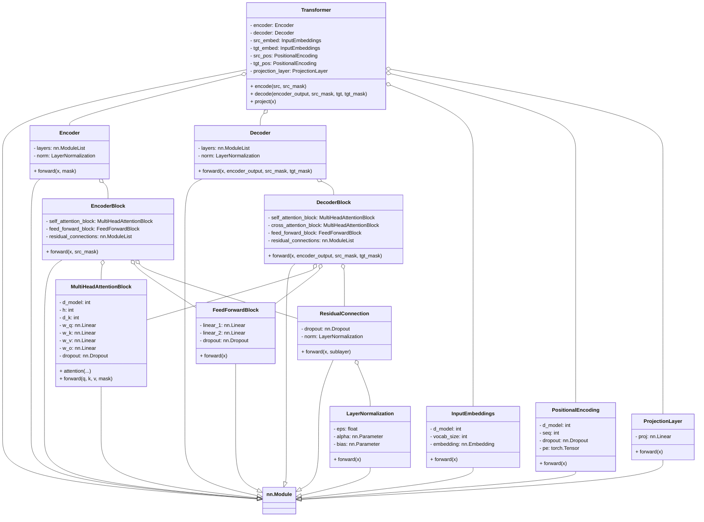

```mermaid
classDiagram

    class nn.Module {
    }

    %% InputEmbeddings
    class InputEmbeddings {
        - d_model: int
        - vocab_size: int
        - embedding: nn.Embedding
        + forward(x)
    }
    InputEmbeddings --|> nn.Module

    %% PositionalEncoding
    class PositionalEncoding {
        - d_model: int
        - seq: int
        - dropout: nn.Dropout
        - pe: torch.Tensor
        + forward(x)
    }
    PositionalEncoding --|> nn.Module

    %% LayerNormalization
    class LayerNormalization {
        - eps: float
        - alpha: nn.Parameter
        - bias: nn.Parameter
        + forward(x)
    }
    LayerNormalization --|> nn.Module

    %% FeedForwardBlock
    class FeedForwardBlock {
        - linear_1: nn.Linear
        - linear_2: nn.Linear
        - dropout: nn.Dropout
        + forward(x)
    }
    FeedForwardBlock --|> nn.Module

    %% MultiHeadAttentionBlock
    class MultiHeadAttentionBlock {
        - d_model: int
        - h: int
        - d_k: int
        - w_q: nn.Linear
        - w_k: nn.Linear
        - w_v: nn.Linear
        - w_o: nn.Linear
        - dropout: nn.Dropout
        + attention(...)
        + forward(q, k, v, mask)
    }
    MultiHeadAttentionBlock --|> nn.Module

    %% ResidualConnection
    class ResidualConnection {
        - dropout: nn.Dropout
        - norm: LayerNormalization
        + forward(x, sublayer)
    }
    ResidualConnection --|> nn.Module
    ResidualConnection o-- LayerNormalization

    %% EncoderBlock
    class EncoderBlock {
        - self_attention_block: MultiHeadAttentionBlock
        - feed_forward_block: FeedForwardBlock
        - residual_connections: nn.ModuleList
        + forward(x, src_mask)
    }
    EncoderBlock --|> nn.Module
    EncoderBlock o-- MultiHeadAttentionBlock
    EncoderBlock o-- FeedForwardBlock
    EncoderBlock o-- ResidualConnection

    %% Encoder
    class Encoder {
        - layers: nn.ModuleList
        - norm: LayerNormalization
        + forward(x, mask)
    }
    Encoder --|> nn.Module
    Encoder o-- EncoderBlock

    %% DecoderBlock
    class DecoderBlock {
        - self_attention_block: MultiHeadAttentionBlock
        - cross_attention_block: MultiHeadAttentionBlock
        - feed_forward_block: FeedForwardBlock
        - residual_connections: nn.ModuleList
        + forward(x, encoder_output, src_mask, tgt_mask)
    }
    DecoderBlock --|> nn.Module
    DecoderBlock o-- MultiHeadAttentionBlock
    DecoderBlock o-- FeedForwardBlock
    DecoderBlock o-- ResidualConnection

    %% Decoder
    class Decoder {
        - layers: nn.ModuleList
        - norm: LayerNormalization
        + forward(x, encoder_output, src_mask, tgt_mask)
    }
    Decoder --|> nn.Module
    Decoder o-- DecoderBlock

    %% ProjectionLayer
    class ProjectionLayer {
        - proj: nn.Linear
        + forward(x)
    }
    ProjectionLayer --|> nn.Module

    %% Transformer
    class Transformer {
        - encoder: Encoder
        - decoder: Decoder
        - src_embed: InputEmbeddings
        - tgt_embed: InputEmbeddings
        - src_pos: PositionalEncoding
        - tgt_pos: PositionalEncoding
        - projection_layer: ProjectionLayer
        + encode(src, src_mask)
        + decode(encoder_output, src_mask, tgt, tgt_mask)
        + project(x)
    }
    Transformer --|> nn.Module
    Transformer o-- Encoder
    Transformer o-- Decoder
    Transformer o-- InputEmbeddings
    Transformer o-- PositionalEncoding
    Transformer o-- ProjectionLayer

```