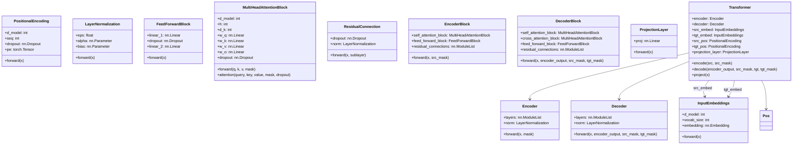

```mermaid
classDiagram
    class InputEmbeddings {
        +d_model: int
        +vocab_size: int
        +embedding: nn.Embedding
        +forward(x)
    }

    class PositionalEncoding {
        +d_model: int
        +seq: int
        +dropout: nn.Dropout
        +pe: torch.Tensor
        +forward(x)
    }

    class LayerNormalization {
        +eps: float
        +alpha: nn.Parameter
        +bias: nn.Parameter
        +forward(x)
    }

    class FeedForwardBlock {
        +linear_1: nn.Linear
        +dropout: nn.Dropout
        +linear_2: nn.Linear
        +forward(x)
    }

    class MultiHeadAttentionBlock {
        +d_model: int
        +h: int
        +d_k: int
        +w_q: nn.Linear
        +w_k: nn.Linear
        +w_v: nn.Linear
        +w_o: nn.Linear
        +dropout: nn.Dropout
        +forward(q, k, v, mask)
        +attention(query, key, value, mask, dropout)
    }

    class ResidualConnection {
        +dropout: nn.Dropout
        +norm: LayerNormalization
        +forward(x, sublayer)
    }

    class EncoderBlock {
        +self_attention_block: MultiHeadAttentionBlock
        +feed_forward_block: FeedForwardBlock
        +residual_connections: nn.ModuleList
        +forward(x, src_mask)
    }

    class Encoder {
        +layers: nn.ModuleList
        +norm: LayerNormalization
        +forward(x, mask)
    }

    class DecoderBlock {
        +self_attention_block: MultiHeadAttentionBlock
        +cross_attention_block: MultiHeadAttentionBlock
        +feed_forward_block: FeedForwardBlock
        +residual_connections: nn.ModuleList
        +forward(x, encoder_output, src_mask, tgt_mask)
    }

    class Decoder {
        +layers: nn.ModuleList
        +norm: LayerNormalization
        +forward(x, encoder_output, src_mask, tgt_mask)
    }

    class ProjectionLayer {
        +proj: nn.Linear
        +forward(x)
    }

    class Transformer {
        +encoder: Encoder
        +decoder: Decoder
        +src_embed: InputEmbeddings
        +tgt_embed: InputEmbeddings
        +src_pos: PositionalEncoding
        +tgt_pos: PositionalEncoding
        +projection_layer: ProjectionLayer
        +encode(src, src_mask)
        +decode(encoder_output, src_mask, tgt, tgt_mask)
        +project(x)
    }

    Transformer --> Encoder
    Transformer --> Decoder
    Transformer --> InputEmbeddings : src_embed
    Transformer --> InputEmbeddings : tgt_embed
    Transformer --> Pos
```